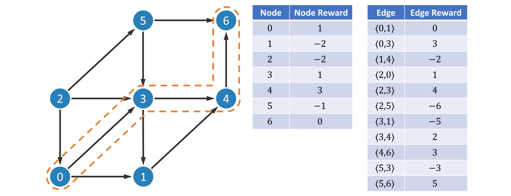
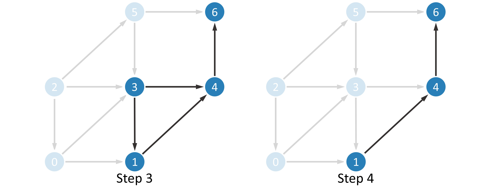

Understanding OASS
==================

Basic Theory
------------

Optimal Action Space Search (OASS) is an algorithm for path planning problems on directed acyclic graphs (DAG) based on reinforcement learning (RL) theory. This document will help you understand the basic theory of OASS.

First we need to clarify what a directed acyclic graph is. A directed graph :math:`G` is usually defined as the set of vertices (nodes) and edges, i.e. :math:`G=(V,E)`, where :math:`V` is the set containing all vertices, :math:`E\subset V\times V` is the set of all edges. For example, the following figure is an example of a directed graph.

.. math::

   V=\{0,1,2,3,4,5,6\},

.. math::

   E=\{
   \langle 0,1\rangle,
   \langle 0,3\rangle,
   \langle 1,4\rangle,
   \langle 2,0\rangle,
   \langle 2,3\rangle,
   \langle 2,5\rangle,
   \langle 3,1\rangle,
   \langle 3,4\rangle,
   \langle 4,6\rangle,
   \langle 5,3\rangle,
   \langle 5,6\rangle
   \}.

As for directed acyclic graphs, they are directed graphs without loops. Of course, the above example is also a directed acyclic graph. In addition, we add a reward to each node and each edge. Use :math:`R(u)` to denote the reward obtained when arriving at node :math:`u`, and :math:`R(\langle u,v\rangle)` to denote the reward obtained when passing through edge :math:`\langle u,v\rangle`. We want to find a path :math:`(u_1,u_2,\dots,u_n)` such that the sum of the rewards obtained when passing through this path is maximized, i.e.

.. math::

   \mathop{\arg\max}_{u_1,u_2,\dots,u_n}R=\sum_{i=1}^n R(u_i)+\sum_{i=1}^{n-1}R(\langle u_i,u_{i+1}\rangle),

.. math::

   s.t. \begin{cases}
   u_i\in V,&i=1,2,\dots,n,\\
   \langle u_i,u_{i+1} \rangle\in E,&i=1,2,\dots,n-1.
   \end{cases}

This is just an algorithmic problem and is not difficult to solve. First we perform topological sorting. Topological sorting is to sort all nodes so as to ensure that: if edge :math:`\langle u,v\rangle` exists, then node :math:`u` ranks in front of :math:`v` in the sorting result. The topological sort is simple: find the node with entry degree :math:`0` (the node without any edge pointing to it), then delete it, and repeat the process.

.. image:: ../_static/3.jpg

.. image:: ../_static/5.jpg

Record the order in which these nodes are deleted, which is the result of the topological sort.

.. math::

   (2,0,5,3,1,4,6)

.. note::

    1. If there are no nodes with entry degree :math:`0` in a particular step, it means that there is a ring in this graph.
    2. The result of topological sorting is not unique. Notice that after the first step, the entry degree of both node :math:`0` and node :math:`5` is :math:`0`, so it is also reasonable to delete node :math:`5` in the second step.

Next, we denote by :math:`G(u)` the subsequent rewards obtained when starting at :math:`u` and by :math:`G^*(u)` the maximum value of :math:`G(u)` provided that the optimal strategy is adopted, excluding the rewards obtained when arriving at node :math:`u` and before that. Obviously, a dynamic programming algorithm can be constructed using a simple state transfer equation.

.. math::

   G^*(u)=\mathop{\arg\max}_{v\in N(u)} (R(v)+G^*(v)),

where :math:`N(u)=\{v|\langle u,v\rangle\in E\}` denotes the set of nodes that can be reached in one step starting from node :math:`u`. The premise of using this formula to compute the optimal strategy is that :math:`\{G^*(v)|v\in N(u)\}` has been computed before computing :math:`G^*(u)`. It is only necessary to compute the results in reverse order according to the topological ordering.

This is a very simple problem, isn't it? But note that being able to do so assumes that we can see the complete graph structure. If at each node we can only observe a little bit of information :math:`O(u)`, consider constructing a strategy using some neural network structure :math:`\pi`. We use :math:`\pi(v|O(u))` to denote the probability of the next move to node :math:`v`, and of course

.. math::

   \sum_{v\in N(u)}\pi(v|O(u))=1.

If the strategy :math:`\pi` is strong enough, it is possible to achieve :math:`G(u)=G^*(u)`. We compute the mathematical expectation :math:`E(G(u)|\pi)` based on the strategy :math:`\pi`.

.. math::

   E(G(u)|\pi)=\sum_{v\in N(u)}\pi\big(v|O(u)\big)\Big(R(\langle u,v\rangle)+R(v)+E\big(G(v)|\pi\big)\Big).

In a similar way, the results are calculated in reverse order according to the topological sort.

We want to make :math:`E(G(u)|\pi)` as large as possible. Since a neural network model is used, using a gradient-based optimization algorithm is a feasible solution. :math:`E(G(u)|\pi)` cannot be utilized as a loss function because it relies on the value of :math:`E(G(v)|\pi)`, which may cause the gradient calculation to be complex and slow. To avoid this pitfall, we directly treat :math:`E(G(v)|\pi)` as a constant and perform single-step optimization.

.. math::

   \nabla \mathcal L=\sum_{v\in N(u)}\Big(R(\langle u,v\rangle)+R(v)+E\big(G(v)|\pi\big)\Big)\nabla\pi\big(v|O(u)\big).

In other words, the coefficients :math:`R(\langle u,v\rangle)+R(v)+E\big(G(v)|\pi\big)` can be directly passed as gradients to the output layer :math:`\pi\big(v|O(u)\big)` of the neural network for optimization.

Integration with Reinforcement Learning Theory
----------------------------------------------

The above theory is not enough to build a robust algorithm, but also needs to refer to modern reinforcement learning theory for more refined adjustment. The final gradient formula is

.. image:: ../_static/7.jpg

Discount Factor
~~~~~~~~~~~~~~~

In modern reinforcement learning theory, the reward function :math:`G(u)` usually carries a discount factor :math:`\gamma\in [0,1]`, i.e.

.. math::

   G(u_1)=
   \big(R(\langle u_1,u_2\rangle)+R(u_2)\big)
   +\gamma\big(R(\langle u_2,u_3\rangle)+R(u_3)\big)
   +\gamma^2\big(R(\langle u_3,u_4\rangle)+R(u_4)\big)
   +\dots

When :math:`\gamma=1`, it is exactly the same as described in the previous section. When :math:`\gamma<1`, i.e., short-term rewards are considered more important than future rewards. We set the discount factor to a customizable hyperparameter, but we still do not recommend using values other than :math:`1`, as this may cause the OASS method to not perceive the distant rewards.

Baseline Strategy
~~~~~~~~~~~~~~~~~

Noting that the range of values of the coefficients :math:`R(\langle u,v\rangle)+R(v)+E\big(G(v)|\pi\big)` depends on the definition of :math:`R`, we want to better guide the strategy :math:`\pi` to update in the direction of improvement, and therefore introduce the baseline in reinforcement learning. The coefficient after adding the baseline is usually referred to as the advantage function in reinforcement learning. A positive value indicates that increasing the corresponding probability value results in more reward, and a negative value indicates that decreasing the corresponding probability value results in more reward.

We provide three methods for calculating the baseline :math:`b(u)`, which can be implemented by modifying the ``baseline_strategy`` in ``oass.GradientCalculator``.

-  ``"zero"``: No baseline.

.. math::

   b(u)=0.

-  ``"random"``: Comparison with uniform random strategy (default value).

.. math::

   b(u)=\sum_{v\in N(u)}\frac{1}{N(u)}\Big(R(\langle u,v\rangle)+R(v)+E\big(G(v)|\pi\big)\Big).

-  ``"self"``: Comparison with itself.

.. math::

   b(u)=E(G(u)|\pi).

Extra Function
~~~~~~~~~~~~~~

Among the many reinforcement learning methods such as A2C, PPO, etc., there is usually a :math:`\log` function, i.e.

.. math::

   \nabla \mathcal L=\sum_{v\in N(u)}\Big(R(\langle u,v\rangle)+R(v)+\gamma E\big(G(v)|\pi\big)-b(u)\Big)\nabla\log\pi\big(v|O(u)\big).

The reinforcement learning theoretical framework has its own set of theoretical support for this :math:`\log` function, but in our experiments we found that the :math:`\log` function sometimes speeds up convergence, but sometimes leads to model instability. Therefore we make it a customizable hyperparameter and do not use the :math:`\log` function by default. You can change it by modifying ``extra_function`` in ``oass.GradientCalculator``.

-  ``"none"``: No extra functions.
-  ``"log"``: Using :math:`\log` function.
