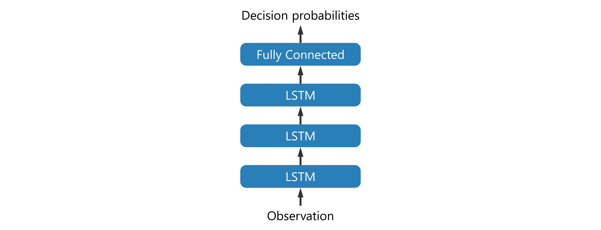

OASS for Algorithmic Trading
============================

This tutorial is an example of applying OASS to algorithmic trading. Leveraging OASS, we can train a neural network model to make buy and sell decisions directly and achieve maximum returns.

Before we start, we need to build a DAG to transform the algorithmic trading problem into a path planning problem. This DAG is shown in the following figure.

.. image:: ../_static/8.jpg

Suppose there are :math:`n` time steps, denoted as :math:`0,1,\dots,n-1`. At each time step, the trader can hold :math:`1`, :math:`0` or :math:`-1` units of stock.

- Holding :math:`1` unit of stock can benefit from the increase of stock price
- Holding :math:`0` units of stock is risk averse
- Holding :math:`-1` units of stock can benefit from the decrease of stock price

Therefore, there are a total of :math:`3n` nodes in this DAG, and each node can be represented as :math:`(i,j)`, where :math:`i\in\{0,1,\dots,n-1\}` represents a time step, and :math:`j\in \{1,0,-1\}` indicates the number of stocks held, that is, the position status. When the position status of two adjacent time steps changes, the trader will buy or sell stocks.

Next, consider how to define node rewards and edge rewards. We hope that the reward can directly represent the profit of trading, so we define the side reward as the amount of change in money.

.. math::

   R(\langle(i,j),(i+1,j+\delta)\rangle)=\begin{cases}
   -\delta p_i^{\text{[buy]}}-\alpha^{\text{[buy]}}|\delta| p_i^{\text{[buy]}},&\text{if }\delta>0\\
   \delta p_i^{\text{[sell]}}-\alpha^{\text{[sell]}}|\delta| p_i^{\text{[sell]}},&\text{otherwise},
   \end{cases}

where :math:`p_i^{\text[buy]}` and :math:`p_i^{[\text{sell}]}` denote the buying and selling prices at the time step :math:`i`, respectively. Usually :math:`p_i^{\text{[buy]}}\ge p_i^{\text{[sell]}}`. :math:`\alpha^{\text{[buy]}}` and :math:`\alpha^{\text{[sell]}}` denote the cost ratio when buying and selling, respectively. In this tutorial, we take the Chinese stock market as an example, thus :math:`\alpha^{\text{[buy]}}=\alpha^{\text{[sell]}}=0.001`.

According to the above definition of side reward, the trader can receive a high reward if it decides to sell. To avoid this situation, we define the node reward for the last time step as the value of the stock held.

.. math::

   R((i,j))=\begin{cases}
   -p_i^{\text{[buy]}},&\text{if }i=n-1\text{ and }j=-1,\\
   p_i^{\text{[sell]}},&\text{if }i=n-1\text{ and }j=1,\\
   0,&\text{otherwise}.
   \end{cases}

Thus, the sum of the rewards on the path is the actual return, and OASS can directly pursue high return end-to-end.

.. image:: ../_static/9.jpg

Since prices vary greatly from stock to stock, it is necessary to normalize the prices, which is very simple.

.. math::

   p_0\leftarrow \frac{p_0^{\text{[buy]}}+p_0^{\text{[sell]}}}{2},

.. math::

   p_i^{\text{[buy]}}\leftarrow \frac{p_i^{\text{[buy]}}}{p_0},

.. math::

   p_i^{\text{[sell]}}\leftarrow \frac{p_i^{\text{[sell]}}}{p_0}.

The above process has been packaged in ``oass.AlgorithmicTrading.TrainerOASS``.

.. code:: python

    import matplotlib.pyplot as plt
    import numpy as np
    import torch
    import oass

We introduce several parameters, where ``DEVICE`` indicates the computing device. We use GPU directly. We will describe other parameters later.

.. code:: python

    SEQUENCE_LENGTH = 240
    HEAD_MASK = 20
    TAIL_MASK = 220
    INPUT_SIZE = 49
    DEVICE = torch.device("cuda")

Read the data. The dataset is stored in ``.npz`` format, and you can use the ``np.savez_compressed`` function to get a file in ``.npz`` format. The data needs to contain three parts.

- ``input_data``: The observation matrix of the model at each time step. ``shape=(SEQUENCE_NUM, SEQUENCE_LENGTH, INPUT_SIZE)``
- ``buy_price``: The price when buying at the buy time step, i.e. :math:`p_i^{\text{[buy]}}`. ``shape=(SEQUENCE_NUM, SEQUENCE_LENGTH)``
- ``sell_price``: The price when selling at the buy time step, i.e. :math:`p_i^{\text{[sell]}}`. ``shape=(SEQUENCE_NUM, SEQUENCE_LENGTH)``

Due to the privacy of financial data, We are sorry that we cannot provide large-scale real data, we can only provide a sample data, but it is enough to demonstrate the power of OASS.

.. code:: python

    def get_dataloader(file_path):
        data = np.load(file_path, allow_pickle=True)
        input_data = torch.tensor(data["input_data"], dtype=torch.float)
        buy_price = torch.tensor(data["buy_price"], dtype=torch.float)
        sell_price = torch.tensor(data["sell_price"], dtype=torch.float)
        dataset = torch.utils.data.TensorDataset(input_data, buy_price, sell_price)
        data_loader = torch.utils.data.DataLoader(
            dataset=dataset,
            batch_size=32,
            shuffle=True
        )
        return data_loader
    
    data_loader_train = get_dataloader("data/at/example_train_data.npz")

Build a neural network model that is a very simple multilayer LSTM model with input ``BATCH_SIZE`` :math:`\times` ``SEQUENCE_LENGTH`` :math:`\times` ``INPUT_SIZE`` observation and output ``BATCH_SIZE`` :math:`\times` ``SEQUENCE_LENGTH`` :math:`\times` :math:`3` :math:`\times` :math:`3` decision probabilities.

.. code:: python

    class TradeModel(torch.nn.Module):
        '''A basic model for OASS. This model contains a multilayer LSTM and a Fully connected layer. This model only takes environment states as input. The output at each time step is a 9-dimensional vector, i.e., a 3x3 matrix.
        
        Args:
            input_size (int): The dimension of environment state at one time step.
            hidden_size (int): The hidden_size in LSTM module.
            num_layers (int): The number of layer in LSTM module.
            dropout (int): The dropout probability of each layer except the last layer in LSTM module.
        '''
    
        def __init__(self, input_size, hidden_size=32, num_layers=3, dropout=0.2):
            super(TradeModel, self).__init__()
            self.LSTM_layers = torch.nn.LSTM(
                input_size=input_size, hidden_size=hidden_size, num_layers=num_layers, dropout=dropout, batch_first=True)
            self.actor_layer = torch.nn.Linear(hidden_size, 9, bias=False)
    
        def forward(self, x):
            '''Forward function.
    
            Args:
                x (torch.tensor): A batch of sequencial environment states. The shape is ``(batch_size, sequence_length, input_size)``.
    
            Returns:
                action_prob (torch.tensor): The model\'s output. The shape is ``(batch_size, sequence_length, 3, 3)``.
            '''
            x = self.LSTM_layers(x)[0]
            action_prob = self.actor_layer(x)
            action_prob = action_prob.reshape((
                action_prob.shape[0],
                action_prob.shape[1],
                3, 3
            ))
            action_prob = torch.softmax(action_prob, axis=-1)
            return action_prob

Considering the structure of the LSTM model, there is not enough historical information to make reliable decisions in the first few time steps of the sequence. Considering the principle of the OASS algorithm, there is not enough future information in the last few time steps to generate rewards. Therefore, we ignore the opening and closing time steps, which can be achieved by modifying the ``HEAD_MASK`` and ``TAIL_MASK`` parameters.

.. image:: ../_static/11.jpg

.. code:: python

    trainer = oass.AlgorithmicTrading.TrainerOASS(
        head_mask = HEAD_MASK,
        tail_mask = TAIL_MASK,
        sequence_length = SEQUENCE_LENGTH,
        buy_cost_pct = 0.001,
        sell_cost_pct = 0.001,
        device = DEVICE
    )
    model = TradeModel(input_size=49, hidden_size=16, num_layers=3).to(DEVICE)
    optimizer = torch.optim.Adam(model.parameters())
    decision_maker = oass.AlgorithmicTrading.DecisionMakerOASS(
        head_mask = HEAD_MASK,
        tail_mask = TAIL_MASK,
        device = DEVICE
    )

A sequence is selected in the training data to show the decisions of the model before training.

.. code:: python

    example_data = np.load("data/at/example_train_data.npz", allow_pickle=True)
    example_id = 0
    example_input_data = example_data["input_data"][example_id: example_id+1]
    example_buy_price = example_data["buy_price"][example_id: example_id+1]
    example_sell_price = example_data["sell_price"][example_id: example_id+1]
    example_data.close()
    
    def show_decision(decision_maker, model, input_data, buy_price, sell_price):
        signal_data = (decision_maker(model, input_data) - 1).tolist()
        buy_price, sell_price, signal_data = buy_price[0], sell_price[0], signal_data[0]
        plt.figure(figsize=(16,9))
        plt.subplot(3,1,1)
        plt.plot(buy_price, label="buy price")
        plt.plot(sell_price, label="sell price")
        buy_point = [i for i in range(1, len(signal_data)) if signal_data[i]>signal_data[i-1]]
        for i,p in enumerate(buy_point):
            if i==0:
                plt.axvline(p, color="#2ca02c", label="buy point")
            else:
                plt.axvline(p, color="#2ca02c")
        sell_point = [i for i in range(1, len(signal_data)) if signal_data[i]<signal_data[i-1]]
        for i,p in enumerate(sell_point):
            if i==0:
                plt.axvline(p, color="#d62728", label="sell point")
            else:
                plt.axvline(p, color="#d62728")
        plt.legend()
        plt.subplot(3,1,2)
        plt.plot(signal_data, label="position")
        plt.ylim(-1.2,1.2)
        plt.legend()
        plt.subplot(3,1,3)
        money, stock = 0, 0
        asset_list = []
        for buy_p, sell_p, signal in zip(buy_price, sell_price, signal_data):
            if signal>stock:
                delta = signal - stock
                money -= delta * buy_p
                money -= delta * buy_p * 0.001
            else:
                delta = stock - signal
                money += delta * sell_p
                money -= delta * sell_p * 0.001
            stock = signal
            asset_list.append(money + stock*(buy_p+sell_p)/2)
        plt.plot(asset_list, label="asset")
        plt.legend()
    
    
    show_decision(decision_maker, model, example_input_data, example_buy_price, example_sell_price)

.. image:: ../_static/oass_at2_7_0.png

Next, we start the training process. Note that we use curriculum learning to first train with no transaction costs to encourage the model to capture short-term market changes, and then gradually increase the transaction costs to guide the model to construct a robust investment strategy. Formally, a difficulty factor :math:`d\in [0,1]` is defined. The transaction price :math:`p_i^{\text{[buy]}},p_i^{\text{[sell]}}` and the rate :math:`\alpha^{\text{[buy]}},\alpha^{\text{ sell}}` are affected by this.

.. math::

   p_i^{\text{[buy]}}\leftarrow \frac{1+d}{2}p_i^{\text{[buy]}}+\frac{1-d}{2}p_i^{\text{[sell]}},

.. math::

   p_i^{\text{[sell]}}\leftarrow \frac{1-d}{2}p_i^{\text{[buy]}}+\frac{1+d}{2}p_i^{\text{[sell]}},

.. math::

   \alpha^{\text{[buy]}}\leftarrow d\alpha^{\text{[buy]}},

.. math::

   \alpha^{\text{[sell]}}\leftarrow d\alpha^{\text{[sell]}}.

.. code:: python

    for epoch in range(1000):
        trainer.difficulty = max((epoch+1-200)/800, 0)
        _, reward_train = trainer.train_epoch(model, data_loader_train, optimizer)
        print("epoch:", epoch, "reward:", reward_train)
    
    show_decision(decision_maker, model, example_input_data, example_buy_price, example_sell_price)

.. parsed-literal::

    epoch: 0 reward: -4.729216948063408e-05
    epoch: 1 reward: -2.0203719886443567e-05
    epoch: 2 reward: -5.471992694477254e-06
    epoch: 3 reward: 6.819567828551503e-06
    epoch: 4 reward: -1.1619394611772117e-05
    epoch: 5 reward: 3.274395907648531e-05
    \.\.\.
    epoch: 995 reward: 0.04295553291798985
    epoch: 996 reward: 0.03634062086589008
    epoch: 997 reward: 0.03797032271239929
    epoch: 998 reward: 0.038265388261650886
    epoch: 999 reward: 0.038311712370954334
    

.. image:: ../_static/oass_at2_8_1.png

It is evident that with the assistance of OASS, the model is able to find high-return investment decisions.
